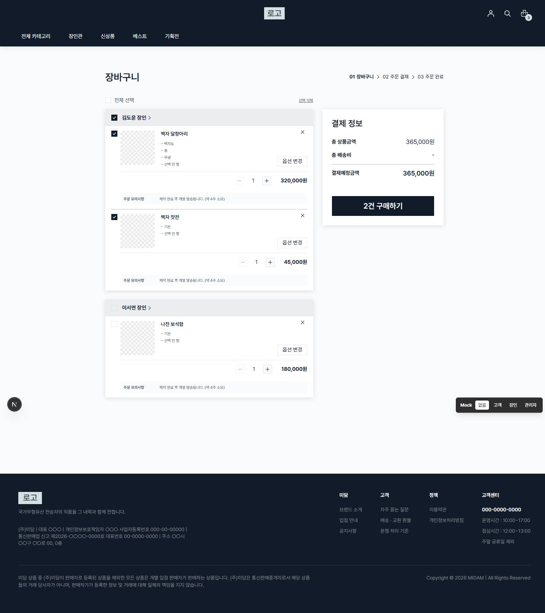
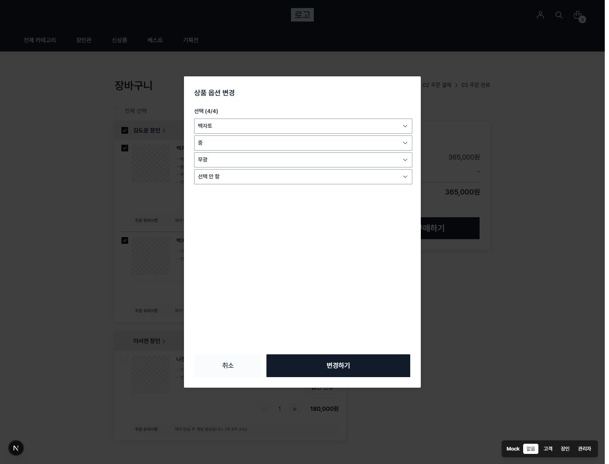
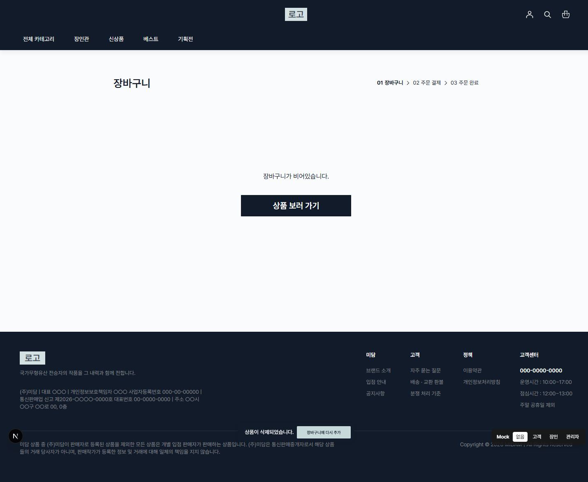

# 장바구니 UI (CA-1)

## 범위와 실행

`/cart`는 비회원도 접근할 수 있다. `NEXT_PUBLIC_API_MOCKING=enabled`에서는 상세에서 담은 상품을 메모리 store로 공유한다. 처음에는 빈 장바구니이며 고정 샘플은 Storybook에만 사용한다. 실제 API 모드는 준비 중 안내를 표시한다. 실제 주문 API/결제 SDK/영구 저장은 포함하지 않는다.

- 개발 실행: `npm run dev -- --port 3151`
- Storybook: `npx storybook dev -p 6151 --ci --no-open`
- 현재 개발 기준 문서는 `docs/architecture.md`, `docs/conventions.md`, `docs/git-convention.md`이다.
- 승인된 제출 계획과 보라색 원문: [구매 UI 계획](superpowers/plans/2026-09-17-cart-checkout-ui-plan.md), [Figma 원문 JSON](superpowers/plans/2026-09-17-cart-checkout-figma-source.json). 원문 부록은 수정하지 않았다.

## 동작

- 구매 가능 상품만 전체·장인·항목 선택 대상이다. 선택 상품의 `단가 × 수량`을 합산한다. 샘플 배송비는 0원이며 별도 배송 정책은 만들지 않는다.
- 수량은 1부터 각 샘플 `maxQuantity`까지 제한한다. 품절은 선택·옵션·수량 변경이 불가하나 삭제는 가능하다.
- 단건·선택 삭제는 확인 후 실행하며 가장 최근 삭제 1회의 항목과 인덱스를 저장한다. 복구는 남아 있는 상품의 최신 변경을 보존하면서 원래 순서를 복원한다. 삭제 알림과 복구 기회는 8초 뒤 종료되며, 새 삭제가 발생하면 시간이 다시 시작된다.
- 옵션은 필수 최대 3개와 존재하는 선물 옵션만 표시한다. 선물의 ‘선택 안 함’도 완료값이다. 선행 선택이 유효하지 않으면 후속 값을 지우고 다음 선택을 연다. 미완성 초안은 취소 시 버린다. 완성된 조합의 재선택은 유효할 때만 즉시 적용한다.
- 옵션 누락 제출은 빨간 테두리와 하단 토스트를 표시하고 첫 누락 필드에 포커스를 둔다. Dialog/Select의 포털·키보드·스크롤 동작을 재사용한다.
- 비회원 구매는 로그인 안내 후 `/login?returnUrl=%2Fcart`로 이동한다. 로그인 복귀 후 구매 버튼을 다시 누르는 계약이다.
- 장인 이름은 후속 상세 화면이 없어 준비 중 Toast를 표시한다.

## 장바구니 → 체크아웃 연결

상세의 MSW 담기 요청 성공 후 상품·옵션·수량·단가를 `usePurchasePreviewStore`에 저장한다.
같은 조합은 중복 추가하지 않으며, 삭제 후 다시 담기는 허용한다. 성공 알림의 "장바구니 보기"는
`/cart`로 이동한다. 카트의 "구매하기"는 선택된 구매 가능 항목의 복사본을
`beginCheckout`에 저장하고 `/checkout/ui-preview-order`로 이동한다.
상세의 "구매하기"는 MSW 검증 후 선택한 항목으로 바로 결제 화면을 연다.
상세에서 담은 항목의 "옵션 다시 선택"은 상세로 돌아간다. 샘플 옵션 모달을 실제 상품에 적용하지 않는다.
새로고침·로그아웃·사용자 전환 시 메모리 데이터는 초기화한다. 개인정보나 결제정보는 URL/스토리지에 넣지 않는다.

공통 구매 부품·store·ProductOrder 확장은 route에 의존하지 않는 선행 커밋으로 분리되어 checkout/complete 화면에서 재사용된다.

## Storybook과 검증

`Pages/Cart`: Default, MixedSoldOut, SoldOut, Empty, Login, Delete, UndoToast.
`Pages/Cart/Options`: Default, Selecting, Selected, Warning, WithoutGift.
기본·품절·빈 화면·옵션 기본/선택 중/완료/경고·삭제 확인/복구 토스트·비회원 안내를 각각 재현한다.

선택·수량 금액·품절 제외·삭제 복구·로그인 분기·옵션 순서·유효한 즉시 적용·누락 포커스·Escape 복귀를 단위/컴포넌트 테스트로 검증한다. 공통 store는 복사본 격리와 초기화를 검증한다.

1440px 브라우저에서 기본/옵션/전체삭제 후 빈 화면을 캡처했다. GNB·Footer와 기존 mock identity switcher는 현재 저장소의 공통 shell이다. 375×400에서 모달 높이 352px, 본문 높이 162px/scrollHeight 222px로 내부 스크롤과 하단 버튼 유지도 확인했다.

